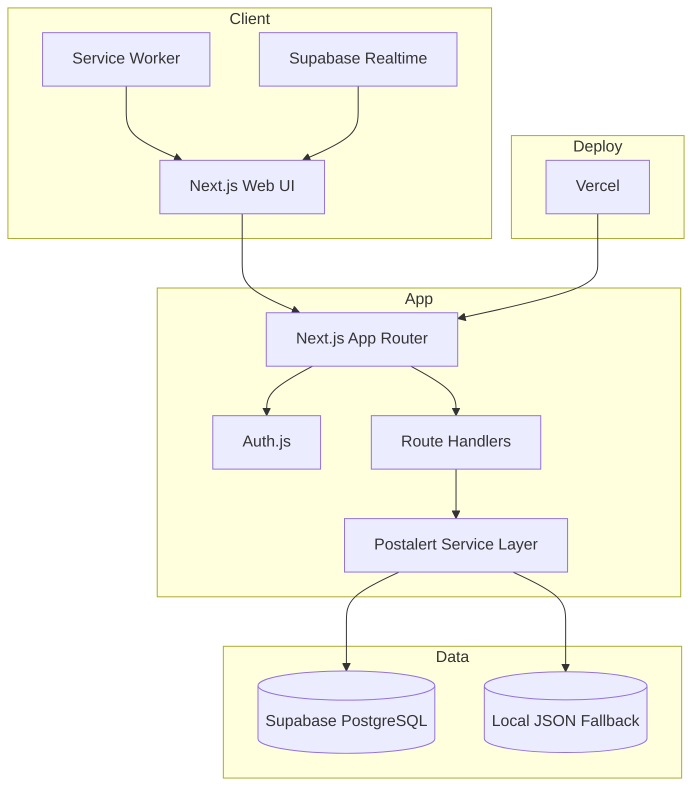

# Design Document: Postalert

## Overview

Postalert is a real-time crowdsourced emergency reporting platform for Jamaica. The application is now designed around a unified Next.js stack so the web interface, API surface, authentication layer, and deployment model all live in one project.

### Product Goals

- Let citizens report incidents quickly with location, media, and severity
- Give authorities a focused dashboard for verification and response actions
- Keep the feed usable on mobile, tablet, and desktop
- Preserve usefulness when the device goes offline
- Support hosted persistence and realtime refresh with Supabase

### Current Tech Stack

- **Application Framework**: Next.js 16 App Router
- **Frontend UI**: React 19, Tailwind CSS, custom global CSS
- **Iconography**: `lucide-react`
- **Authentication**: Auth.js with credentials provider and JWT session strategy
- **Database**: Supabase PostgreSQL
- **Persistence Layer**: Route handlers and shared business logic in `lib/platform-store.js`
- **Realtime**: Supabase Realtime subscriptions with BroadcastChannel fallback
- **Deployment**: Vercel

## Architecture

## Application Structure

### App Router Surfaces

- `/` renders the incident feed, filters, and incident detail drawer
- `/auth` handles citizen and authority authentication flows
- `/report` hosts the multi-step reporting workflow
- `/authority` provides the operational dashboard for authority users
- `/profile` shows user account details, activity, strikes, and notifications
- `/trends` exposes trend counts, heatmap data, and top categories

### Route Handlers

- `app/api/auth/[...nextauth]/route.js` exposes Auth.js handlers
- `app/api/auth/register/route.js` handles citizen and authority sign-up
- `app/api/incidents/*` covers incident listing, retrieval, and vote actions
- `app/api/authority/*` handles dashboard data and authority actions
- `app/api/profile/*` handles profile retrieval and updates
- `app/api/trends/*` handles analytics queries
- `app/api/notifications/*` handles notification registration and preferences
- `app/api/moderation/appeals/route.js` handles strike appeals
- `app/api/health/route.js` exposes deployment health state

## Service Layer Design

### Core Business Module

`lib/platform-store.js` contains the Postalert domain rules:

- user registration and password verification
- strike calculation and posting restrictions
- incident creation, validation, and moderation checks
- confirmation and dispute workflows
- authority dashboard aggregation and action handling
- profile, trends, and notification preference retrieval

### Persistence Strategy

`lib/supabase-persistence.js` adapts the in-memory Postalert domain model to Supabase tables:

- reads users, incidents, confirmations, strikes, notifications, and moderation records
- maps Supabase rows to the shared Postalert object model
- upserts mutated records back to Supabase after each write workflow
- seeds Supabase from the default Postalert dataset when an empty database is detected

If Supabase credentials are not present, the same service layer falls back to `data/local-db.json` for local development.

## Authentication Model

- Auth.js uses a credentials provider backed by Postalert user records
- passwords are hashed with `bcryptjs`
- authenticated sessions use JWT strategy
- protected routes are enforced through `proxy.js`
- authority accounts can exist in a pending read-only state until admin approval

## Realtime and Offline Model

### Realtime

- hosted deployments subscribe to Supabase Realtime changes on the `incidents` table
- local development still uses BroadcastChannel refresh events after mutations
- authority and trend screens refresh when incident state changes

### Offline Support

- incident feed results are cached in local storage
- report submissions are queued while offline and replayed on reconnection
- a service worker is registered for offline-aware behavior

## Data Model

### Primary Tables

- `postalert_users`
- `incidents`
- `confirmations`
- `strikes`
- `device_tokens`
- `moderation_appeals`
- `pending_photo_scans`
- `notifications`

### Domain Notes

- incidents track severity, status, credibility, photos, moderation state, and authority actions
- users track parish, role, verification state, strikes, notification preferences, and last known location
- confirmations are unique per incident and user
- dismissed incidents can add strikes to the reporter

## UI Direction

The interface uses a calm operations-dashboard aesthetic instead of generic consumer SaaS styling:

- dark steel surfaces with warm alert accents
- clean typography with condensed display moments
- no emoji iconography
- `lucide-react` icons throughout
- responsive layouts with the same visual language across mobile and desktop

## Deployment Model

- the project builds as a standard Next.js app on Vercel
- `vercel.json` sets the framework target to `nextjs`
- environment variables cover `AUTH_SECRET`, `AUTH_URL`, and Supabase keys
- the health route can be used for runtime smoke checks after deployment
