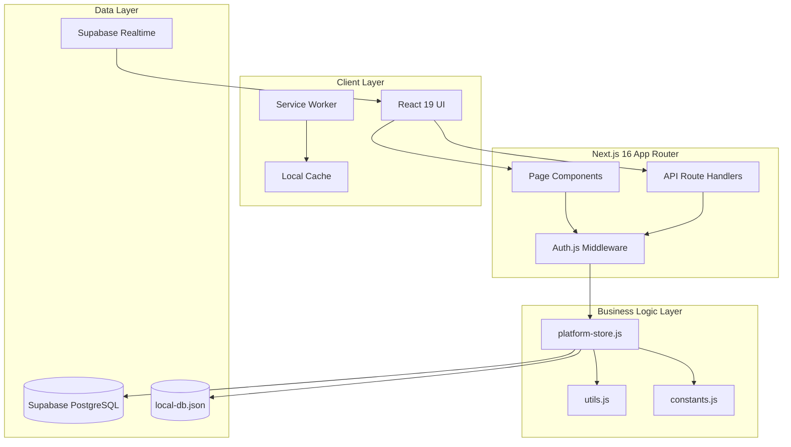
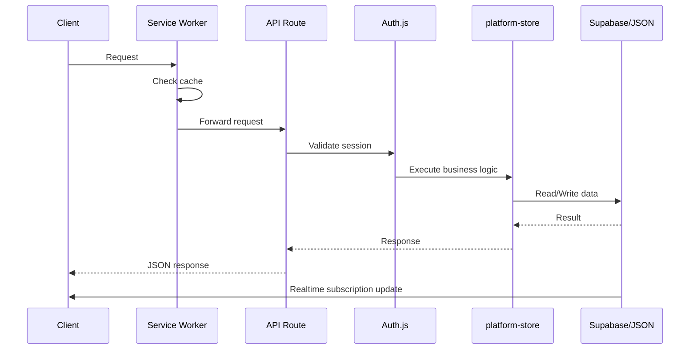
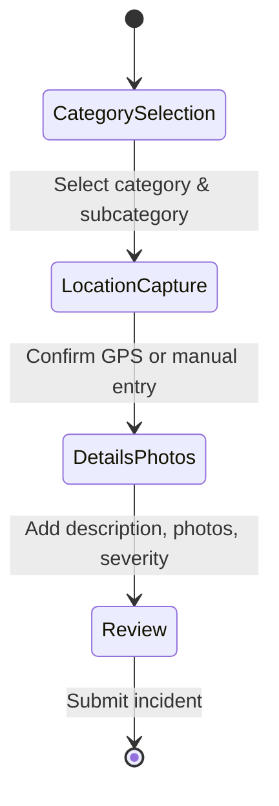
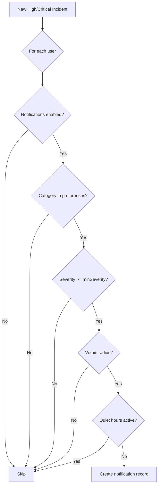
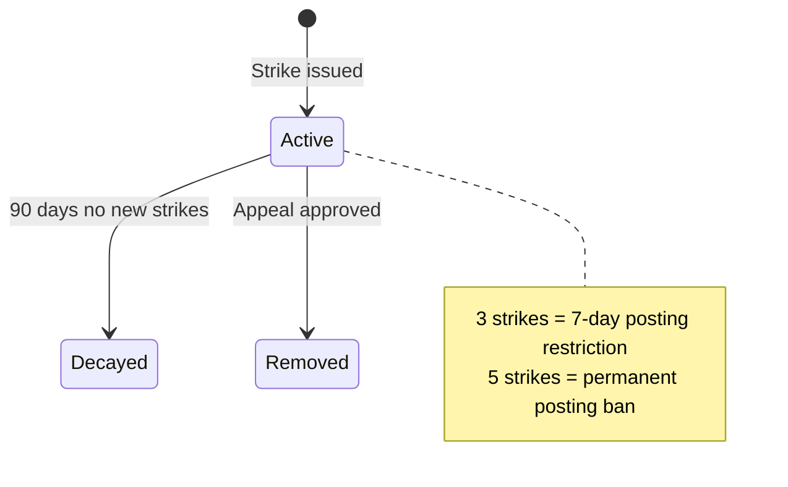
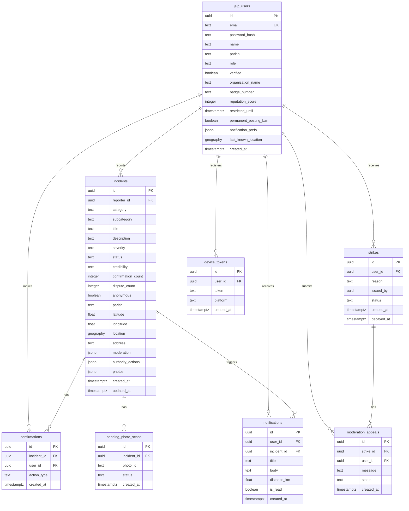

# Design Document: PostAlert MVP

## Overview

PostAlert is a real-time crowdsourced emergency incident reporting platform for Jamaica. This design document covers the technical architecture for the complete MVP including authentication, incident reporting, real-time mapping, authority management, notifications, and analytics.

The system follows a Next.js 16 App Router architecture with React 19, using Supabase PostgreSQL for persistence with local JSON fallback for development. Authentication is handled by Auth.js (NextAuth v5) with JWT sessions.

### Key Design Principles

1. **Offline-First**: Service worker caching with queued submissions for unreliable connectivity
2. **Real-Time**: Supabase Realtime subscriptions for live incident updates
3. **Geographic Focus**: All incidents validated within Jamaica's boundaries (14 parishes)
4. **Role-Based Access**: Citizens, Authorities (verified/pending), and Admins with distinct capabilities
5. **Community Validation**: Confirmation/dispute system for incident credibility

## Architecture



### Request Flow



## Components and Interfaces

### Authentication Module (Auth_Service)

#### Components

| Component | Location | Responsibility |
|-----------|----------|----------------|
| `auth.js` | `/auth.js` | NextAuth configuration with credentials provider |
| `RegisterAPI` | `/app/api/auth/register/route.js` | User registration endpoint |
| `AuthPage` | `/app/auth/page.jsx` | Login/Register UI |
| `SessionProvider` | `/components/providers.jsx` | React session context |

#### Interfaces

```typescript
// Registration payload
interface CitizenRegistration {
  email: string;           // Valid email format
  password: string;        // Min 8 characters
  name: string;            // Display name
  parish: Parish;          // One of 14 Jamaica parishes
}

interface AuthorityRegistration extends CitizenRegistration {
  organizationName: string;  // Official organization
  badgeNumber: string;       // Official badge/ID
  // email must end in .gov.jm or .org.jm
}

// Session user (returned after auth)
interface SessionUser {
  id: string;
  email: string;
  name: string;
  parish: Parish;
  role: 'citizen' | 'authority' | 'authority_pending' | 'admin';
  verified: boolean;
  reputationScore: number;
  strikeCount: number;
  canPost: boolean;
  readOnly: boolean;
}

// Auth functions in platform-store.js
registerCitizen(payload: CitizenRegistration): Promise<SessionUser>
registerAuthority(payload: AuthorityRegistration): Promise<SessionUser>
verifyCredentials(email: string, password: string): Promise<SessionUser | null>
getUserById(id: string): Promise<SessionUser | null>
```

### Incident Reporting Module (Incident_Service)

#### Components

| Component | Location | Responsibility |
|-----------|----------|----------------|
| `ReportWizard` | `/app/report/page.jsx` | 4-step incident wizard UI |
| `IncidentsAPI` | `/app/api/incidents/route.js` | Incident CRUD endpoints |
| `IncidentDetailAPI` | `/app/api/incidents/[id]/route.js` | Single incident operations |
| `ConfirmAPI` | `/app/api/incidents/[id]/confirm/route.js` | Confirmation endpoint |
| `DisputeAPI` | `/app/api/incidents/[id]/dispute/route.js` | Dispute endpoint |

#### Wizard Steps



#### Interfaces

```typescript
// Incident creation payload
interface IncidentPayload {
  category: Category;        // Crime, Accident, Natural Disaster, Infrastructure, Community Alert
  subcategory: string;       // Category-specific subcategory
  description: string;       // 10-500 characters
  latitude: number;          // 17.65-18.55 (Jamaica bounds)
  longitude: number;         // -78.45 to -76.1 (Jamaica bounds)
  severity: 'low' | 'medium' | 'high' | 'critical';
  photos?: Photo[];          // Max 3, JPEG/PNG, 5MB each
  anonymous?: boolean;       // Hide reporter identity
  address?: string;          // Optional address text
}

// Stored incident
interface Incident {
  id: string;
  reporterId: string;
  category: Category;
  subcategory: string;
  title: string;             // Auto-generated: "{subcategory} in {parish}"
  description: string;
  severity: Severity;
  status: 'active' | 'responding' | 'authority_verified' | 'resolved' | 'dismissed';
  credibility: 'pending' | 'verified' | 'flagged';
  confirmationCount: number;
  disputeCount: number;
  anonymous: boolean;
  photos: Photo[];
  parish: Parish;            // Auto-computed from coordinates
  latitude: number;
  longitude: number;
  address: string;
  moderation: ModerationStatus;
  authorityActions: AuthorityAction[];
  createdAt: string;
  updatedAt: string;
}

// Core functions
createIncident(payload: IncidentPayload, requesterId: string): Promise<{incident: Incident, photoWarning?: string}>
listIncidents(filters: IncidentFilters, requesterId?: string): Promise<PaginatedResult<Incident>>
getIncidentById(id: string, requesterId?: string): Promise<Incident>
confirmIncident(id: string, requesterId: string): Promise<ConfirmationResult>
disputeIncident(id: string, requesterId: string): Promise<ConfirmationResult>
```

### Map Service (Map_Service)

#### Components

| Component | Location | Responsibility |
|-----------|----------|----------------|
| `MapView` | `/components/platform-shell.jsx` | Interactive map with markers |
| `IncidentMarker` | Embedded in MapView | Color-coded severity markers |
| `FilterPanel` | Embedded in MapView | Category/severity/parish filters |

#### Marker Color Scheme

| Severity | Color | Tailwind Class |
|----------|-------|----------------|
| Low | Emerald | `bg-emerald-500` |
| Medium | Amber | `bg-amber-500` |
| High | Orange | `bg-orange-500` |
| Critical | Rose | `bg-rose-500` |

#### Map Configuration

```typescript
const MAP_CONFIG = {
  center: { lat: 18.1096, lng: -77.2975 },  // Jamaica center
  bounds: {
    latMin: 17.65, latMax: 18.55,
    lngMin: -78.45, lngMax: -76.1
  },
  defaultZoom: 9  // Shows all 14 parishes
};
```

### Authority Dashboard (Authority_Dashboard)

#### Components

| Component | Location | Responsibility |
|-----------|----------|----------------|
| `AuthorityPage` | `/app/authority/page.jsx` | Dashboard UI |
| `DashboardAPI` | `/app/api/authority/dashboard/route.js` | Dashboard data endpoint |
| `ActionAPI` | `/app/api/authority/incidents/[id]/[action]/route.js` | Authority action endpoint |
| `PendingAuthoritiesAPI` | `/app/api/admin/authorities/pending/route.js` | Admin: list pending |
| `ApproveAPI` | `/app/api/admin/authorities/[id]/approve/route.js` | Admin: approve authority |

#### Interfaces

```typescript
// Dashboard response
interface DashboardData {
  parish: Parish;
  incidents: Incident[];
  stats: {
    totalActive: number;
    byCategory: Record<Category, number>;
    bySeverity: Record<Severity, number>;
  };
}

// Authority actions
type AuthorityAction = 'verify' | 'respond' | 'resolve' | 'dismiss';

interface ActionPayload {
  action: AuthorityAction;
  notes?: string;  // Max 300 characters
}

// Functions
getAuthorityDashboard(requesterId: string, parishOverride?: string): Promise<DashboardData>
applyAuthorityAction(requesterId: string, incidentId: string, action: AuthorityAction, notes?: string): Promise<Incident>
listPendingAuthorities(requesterId: string): Promise<SessionUser[]>
approveAuthority(requesterId: string, authorityId: string): Promise<SessionUser>
```

### Notification Service (Notification_Service)

#### Components

| Component | Location | Responsibility |
|-----------|----------|----------------|
| `NotificationPrefsAPI` | `/app/api/notifications/preferences/route.js` | Preferences CRUD |
| `RegisterDeviceAPI` | `/app/api/notifications/register/route.js` | Device token registration |
| `ServiceWorker` | `/public/sw.js` | Push notification handling |

#### Notification Logic



#### Interfaces

```typescript
interface NotificationPreferences {
  enabled: boolean;
  categories: Category[];           // Which categories to notify
  minSeverity: Severity;            // Minimum severity threshold
  radiusKm: number;                 // Distance threshold (default 5km)
  quietHoursStart: string;          // HH:MM format (default "22:00")
  quietHoursEnd: string;            // HH:MM format (default "06:00")
}

interface NotificationRecord {
  id: string;
  userId: string;
  incidentId: string;
  title: string;
  body: string;
  distanceKm: number;
  createdAt: string;
  read: boolean;
}

// Functions
getNotificationPreferences(requesterId: string): Promise<NotificationPreferences>
updateNotificationPreferences(requesterId: string, payload: Partial<NotificationPreferences>): Promise<NotificationPreferences>
registerDevice(requesterId: string, token: string, platform?: string): Promise<{ok: boolean}>
```

### Profile Service (Profile_Service)

#### Components

| Component | Location | Responsibility |
|-----------|----------|----------------|
| `ProfilePage` | `/app/profile/page.jsx` | Profile UI |
| `ProfileAPI` | `/app/api/profile/route.js` | Profile CRUD |
| `ProfileIncidentsAPI` | `/app/api/profile/incidents/route.js` | User's incidents |
| `ProfileActivityAPI` | `/app/api/profile/activity/route.js` | User's activity |

#### Interfaces

```typescript
interface ProfileData {
  user: SessionUser;
  strikes: Strike[];
  notifications: NotificationRecord[];
}

interface ProfileUpdate {
  name?: string;
  parish?: Parish;
  lastKnownLocation?: { lat: number; lng: number };
}

// Functions
getProfile(requesterId: string): Promise<ProfileData>
updateProfile(requesterId: string, payload: ProfileUpdate): Promise<SessionUser>
listProfileIncidents(requesterId: string): Promise<Incident[]>
listProfileActivity(requesterId: string): Promise<ActivityData>
```

### Trends Service (Trends_Service)

#### Components

| Component | Location | Responsibility |
|-----------|----------|----------------|
| `TrendsPage` | `/app/trends/page.jsx` | Analytics dashboard UI |
| `CountsAPI` | `/app/api/trends/counts/route.js` | Incident counts by period |
| `TopCategoriesAPI` | `/app/api/trends/top-categories/route.js` | Category breakdown |
| `HeatmapAPI` | `/app/api/trends/heatmap/route.js` | Parish density data |

#### Interfaces

```typescript
interface TrendsCounts {
  period24h: number;
  period7d: number;
  period30d: number;
}

interface CategoryCount {
  category: Category;
  count: number;
}

interface ParishHeatmap {
  parish: Parish;
  count: number;
  density: 'low' | 'medium' | 'high';
}

// Functions
getTrendsCounts(filters?: DateFilters): Promise<TrendsCounts>
getTopCategories(filters?: DateFilters): Promise<CategoryCount[]>
getHeatmapData(filters?: DateFilters): Promise<ParishHeatmap[]>
```

### Moderation Service (Moderation_Service)

#### Content Scanning

```typescript
const PROHIBITED_KEYWORDS = ['fake bomb', 'target civilians', 'hate speech'];
const SENSITIVE_KEYWORDS = ['gun', 'knife', 'blood', 'child', 'shooting', 'domestic abuse'];

interface ContentScanResult {
  allowed: boolean;      // False if prohibited keywords found
  flagged: boolean;      // True if sensitive keywords found
  violations: string[];  // List of prohibited keywords found
}

function scanContent(description: string): ContentScanResult
```

#### Strike System



#### Interfaces

```typescript
interface Strike {
  id: string;
  userId: string;
  reason: string;
  issuedBy: string;
  status: 'active' | 'decayed' | 'removed';
  createdAt: string;
  decayedAt?: string;
}

interface ModerationAppeal {
  id: string;
  strikeId: string;
  userId: string;
  message: string;
  status: 'submitted' | 'approved' | 'rejected';
  createdAt: string;
}

// Functions
submitAppeal(requesterId: string, payload: {strikeId: string, message: string}): Promise<ModerationAppeal>
listAppeals(requesterId: string): Promise<ModerationAppeal[]>
```

### Comments Service (Comments_Service)

#### Interfaces

```typescript
interface Comment {
  id: string;
  incidentId: string;
  userId: string;
  userName: string;
  content: string;
  createdAt: string;
}

// Functions (to be implemented)
createComment(incidentId: string, requesterId: string, content: string): Promise<Comment>
listComments(incidentId: string): Promise<Comment[]>
deleteComment(commentId: string, requesterId: string): Promise<void>
```

## Data Models

### Database Schema (Supabase PostgreSQL)



### Local JSON Fallback Structure

```typescript
interface LocalDatabase {
  storageMode: 'local' | 'supabase';
  users: User[];
  incidents: Incident[];
  confirmations: Confirmation[];
  strikes: Strike[];
  deviceTokens: DeviceToken[];
  moderationAppeals: ModerationAppeal[];
  pendingPhotoScans: PhotoScan[];
  notifications: NotificationRecord[];
}
```

### Geographic Constants

```typescript
// Jamaica's 14 parishes with center coordinates
const PARISH_CENTERS = {
  'Kingston': { lat: 17.9712, lng: -76.7928 },
  'St. Andrew': { lat: 18.0226, lng: -76.7936 },
  'St. Thomas': { lat: 17.9077, lng: -76.3576 },
  'Portland': { lat: 18.176, lng: -76.45 },
  'St. Mary': { lat: 18.356, lng: -76.897 },
  'St. Ann': { lat: 18.405, lng: -77.103 },
  'Trelawny': { lat: 18.352, lng: -77.647 },
  'St. James': { lat: 18.4712, lng: -77.9188 },
  'Hanover': { lat: 18.409, lng: -78.133 },
  'Westmoreland': { lat: 18.166, lng: -78.16 },
  'St. Elizabeth': { lat: 18.051, lng: -77.848 },
  'Manchester': { lat: 18.042, lng: -77.507 },
  'Clarendon': { lat: 17.964, lng: -77.245 },
  'St. Catherine': { lat: 17.997, lng: -76.955 }
};

// Jamaica boundary validation
const MAP_BOUNDS = {
  latMin: 17.65, latMax: 18.55,
  lngMin: -78.45, lngMax: -76.1
};

function withinJamaica(lat: number, lng: number): boolean {
  return lat >= MAP_BOUNDS.latMin && lat <= MAP_BOUNDS.latMax &&
         lng >= MAP_BOUNDS.lngMin && lng <= MAP_BOUNDS.lngMax;
}
```


## Correctness Properties

*A property is a characteristic or behavior that should hold true across all valid executions of a system—essentially, a formal statement about what the system should do. Properties serve as the bridge between human-readable specifications and machine-verifiable correctness guarantees.*

### Property 1: Registration creates valid accounts with correct defaults

*For any* valid registration payload (citizen or authority), the created account SHALL have the correct role, verified status (true for citizens, false for authorities), and default reputation score (50 for citizens, 65 for authorities).

**Validates: Requirements 1.1, 1.4, 1.7, 1.8**

### Property 2: Password validation rejects short passwords

*For any* password string shorter than 8 characters, registration SHALL be rejected with error code 4004.

**Validates: Requirements 1.2**

### Property 3: Duplicate email registration is rejected

*For any* email that is already registered, a subsequent registration attempt with the same email SHALL be rejected with error code 4090.

**Validates: Requirements 1.3**

### Property 4: Authority email domain validation

*For any* authority registration with an email not ending in `.gov.jm` or `.org.jm`, registration SHALL be rejected with error code 4006.

**Validates: Requirements 1.5**

### Property 5: Password hashing round-trip

*For any* registered user, the stored passwordHash SHALL NOT equal the plaintext password, AND verifying the plaintext password against the hash SHALL return true.

**Validates: Requirements 1.6**

### Property 6: Authentication with valid credentials succeeds

*For any* registered user with email E and password P, calling verifyCredentials(E, P) SHALL return a valid session user object.

**Validates: Requirements 2.1**

### Property 7: Authentication with invalid credentials fails generically

*For any* invalid credential combination (wrong email or wrong password), authentication SHALL fail without revealing which field was incorrect.

**Validates: Requirements 2.2**

### Property 8: Password reset token round-trip

*For any* valid password reset flow, generating a token, then using it to reset the password, SHALL update the password hash AND invalidate the token for future use.

**Validates: Requirements 3.2, 3.5**

### Property 9: Expired reset tokens are rejected

*For any* password reset token older than 1 hour, using it SHALL be rejected with an appropriate error.

**Validates: Requirements 3.3, 3.4**

### Property 10: Category-subcategory mapping is consistent

*For any* category in CATEGORY_SUBCATEGORIES, selecting that category SHALL return exactly the defined subcategories for that category.

**Validates: Requirements 4.2**

### Property 11: Photo validation enforces type and size constraints

*For any* photo upload, the system SHALL accept only JPEG/PNG files up to 5MB, reject invalid types with error code 4016, and limit to 3 photos per incident.

**Validates: Requirements 4.5, 24.1, 24.3, 24.4**

### Property 12: Description length validation

*For any* incident description shorter than 10 characters or longer than 500 characters, submission SHALL be rejected with error code 4013.

**Validates: Requirements 4.6**

### Property 13: Severity levels are all accepted

*For any* severity value in ['low', 'medium', 'high', 'critical'], incident creation SHALL accept that severity.

**Validates: Requirements 4.7**

### Property 14: Anonymous submission hides reporter identity

*For any* incident created with anonymous=true, the serialized incident SHALL show reporter as "Anonymous Reporter" and hide the actual reporter details.

**Validates: Requirements 4.8**

### Property 15: Jamaica boundary validation

*For any* coordinates, if latitude is outside [17.65, 18.55] OR longitude is outside [-78.45, -76.1], incident creation SHALL be rejected with error code 4014.

**Validates: Requirements 5.1, 5.2**

### Property 16: Parish assignment uses nearest center

*For any* valid coordinates within Jamaica, the assigned parish SHALL be the one whose center has the minimum haversine distance to the coordinates, AND both raw coordinates and computed parish SHALL be stored.

**Validates: Requirements 5.3, 5.4**

### Property 17: Incident filtering returns only matching results

*For any* filter combination (categories, severities, parish, date range), listIncidents SHALL return only incidents that match ALL specified filter criteria.

**Validates: Requirements 6.5, 7.3**

### Property 18: Incidents are sorted newest first

*For any* list of incidents returned by listIncidents, the items SHALL be sorted by createdAt in descending order.

**Validates: Requirements 7.1**

### Property 19: Pagination respects page size

*For any* paginated incident list, each page SHALL contain at most 8 items (or the configured limit), and pagination metadata (page, limit, total, hasMore) SHALL be accurate.

**Validates: Requirements 7.2, 23.4**

### Property 20: Incident serialization includes all required fields

*For any* incident, the serialized response SHALL include: id, category, subcategory, title, description, severity, status, credibility, confirmationCount, disputeCount, parish, latitude, longitude, photos, authorityActions, reporter info, and timestamps.

**Validates: Requirements 7.4, 7.5, 8.1, 8.2, 8.3, 8.4**

### Property 21: Voting increments correct counter

*For any* confirmation action, confirmationCount SHALL increase by exactly 1. *For any* dispute action, disputeCount SHALL increase by exactly 1.

**Validates: Requirements 9.1, 9.2**

### Property 22: Self-voting is prevented

*For any* incident, the reporter SHALL NOT be able to confirm or dispute their own incident (error code 4017).

**Validates: Requirements 9.3**

### Property 23: Duplicate voting is prevented

*For any* user who has already voted on an incident, a second vote attempt SHALL be rejected with error code 4091.

**Validates: Requirements 9.4**

### Property 24: Credibility status transitions correctly

*For any* incident, when confirmationCount reaches 5, credibility SHALL become "verified". When disputeCount exceeds confirmationCount by 3 or more, credibility SHALL become "flagged".

**Validates: Requirements 9.5, 9.6**

### Property 25: Authority dashboard filters by parish

*For any* authority accessing the dashboard, incidents SHALL be filtered to their assigned parish (unless admin with parish override).

**Validates: Requirements 10.1, 10.5**

### Property 26: Dashboard statistics are accurate

*For any* authority dashboard, stats.totalActive SHALL equal the count of incidents with status in ['active', 'responding', 'authority_verified'], and byCategory/bySeverity breakdowns SHALL be accurate.

**Validates: Requirements 10.2**

### Property 27: Unverified authorities have read-only access

*For any* authority with verified=false, attempting authority actions SHALL be rejected with error code 4030.

**Validates: Requirements 10.4, 11.6**

### Property 28: Authority actions update status correctly

*For any* authority action, the incident status SHALL be updated: verify→"authority_verified", respond→"responding", resolve→"resolved", dismiss→"dismissed". Each action SHALL be recorded with authority name, action type, notes (max 300 chars), and timestamp.

**Validates: Requirements 11.1, 11.2, 11.3, 11.5**

### Property 29: Dismiss action issues strike to reporter

*For any* dismiss action by an authority, a strike SHALL be issued to the incident reporter with reason indicating dismissal.

**Validates: Requirements 11.4, 18.3**

### Property 30: Pending authorities list is accurate

*For any* admin request for pending authorities, the result SHALL include all and only authority accounts with verified=false.

**Validates: Requirements 12.1**

### Property 31: Authority approval grants full permissions

*For any* authority approval by admin, the authority's verified status SHALL become true, enabling full authority actions.

**Validates: Requirements 12.2**

### Property 32: Non-admin cannot approve authorities

*For any* non-admin user attempting to approve authorities, the request SHALL be rejected with error code 4031.

**Validates: Requirements 12.3**

### Property 33: Notifications respect user preferences

*For any* high/critical incident, notifications SHALL only be created for users where: notifications are enabled, the category is in their preferences, severity meets their minimum threshold, distance is within their radius, AND it's not during their quiet hours.

**Validates: Requirements 13.1, 13.2, 13.3, 13.4**

### Property 34: Notification content is complete

*For any* notification record, it SHALL include incident category, severity, and distance in the body.

**Validates: Requirements 13.5**

### Property 35: Notification preferences persist and apply

*For any* notification preference update, the new values SHALL be persisted AND applied to all subsequent notification evaluations.

**Validates: Requirements 14.1, 14.2, 14.3, 14.4, 14.5, 14.6**

### Property 36: Comments are stored with metadata and ordered chronologically

*For any* comment submission, it SHALL be stored with user reference and timestamp, AND comments SHALL be returned in chronological order.

**Validates: Requirements 15.1, 15.2**

### Property 37: Comment moderation blocks prohibited content

*For any* comment containing prohibited keywords, submission SHALL be rejected.

**Validates: Requirements 15.3, 15.4**

### Property 38: Users can only delete their own comments

*For any* comment deletion request, it SHALL succeed only if the requester is the comment author.

**Validates: Requirements 15.5**

### Property 39: Posting restrictions apply to comments

*For any* user with posting restrictions (restrictedUntil or permanentPostingBan), comment submissions SHALL be rejected.

**Validates: Requirements 15.6**

### Property 40: Trends aggregation is accurate

*For any* trends query, counts by time period (24h, 7d, 30d) SHALL accurately reflect incidents created within those periods, category counts SHALL match actual category distribution, and parish heatmap SHALL reflect actual incident density.

**Validates: Requirements 16.1, 16.2, 16.3, 16.4**

### Property 41: Profile data is complete

*For any* profile request, the response SHALL include: user name, email, parish, role, reputation score, incidents reported, confirmation/dispute activity, active strikes, and notification preferences.

**Validates: Requirements 17.1, 17.3, 17.4, 17.5, 17.6**

### Property 42: Profile updates persist correctly

*For any* profile update (name, parish, location), the new values SHALL be persisted and returned in subsequent profile requests.

**Validates: Requirements 17.2, 17.7**

### Property 43: Prohibited keywords block submission

*For any* content containing prohibited keywords ('fake bomb', 'target civilians', 'hate speech'), submission SHALL be blocked with error code 4015.

**Validates: Requirements 18.1**

### Property 44: Sensitive keywords flag but allow submission

*For any* content containing sensitive keywords ('gun', 'knife', 'blood', 'child', 'shooting', 'domestic abuse'), the incident SHALL be created with moderation.sensitive=true.

**Validates: Requirements 18.2**

### Property 45: Strike thresholds trigger correct restrictions

*For any* user, accumulating 3 active strikes SHALL trigger a 7-day posting restriction, and accumulating 5 active strikes SHALL trigger a permanent posting ban.

**Validates: Requirements 18.4, 18.5**

### Property 46: Strike decay after 90 days

*For any* user with active strikes and no new strikes for 90 days, the oldest strike SHALL be decayed.

**Validates: Requirements 18.6**

### Property 47: Posting restrictions are enforced

*For any* user with posting restrictions, incident submissions SHALL be rejected with error code 4032.

**Validates: Requirements 18.7**

### Property 48: Appeal creation and limits

*For any* strike, a user can submit exactly one appeal, which SHALL be created with status "submitted".

**Validates: Requirements 19.1, 19.2**

### Property 49: Appeal approval removes strike

*For any* approved appeal, the associated strike SHALL be removed (status changed from 'active').

**Validates: Requirements 19.3, 19.4**

### Property 50: Incident serialization round-trip

*For any* valid Incident object, serializing to JSON then deserializing SHALL produce an equivalent object.

**Validates: Requirements 22.5**

### Property 51: API error responses have consistent format

*For any* API error, the response SHALL use the fail() helper format: {error: string, code: number} with appropriate HTTP status codes.

**Validates: Requirements 23.2, 23.3**

### Property 52: Photo metadata is stored completely

*For any* uploaded photo, the stored record SHALL include: unique ID, name, type, size, and scanStatus='queued'.

**Validates: Requirements 24.2, 24.5**

## Error Handling

### Error Code Reference

| Code | HTTP Status | Description | Trigger |
|------|-------------|-------------|---------|
| 4001 | 400 | Invalid parish | Parish not in PARISHES array |
| 4003 | 400 | Missing required fields | Registration missing email/password/name |
| 4004 | 400 | Password too short | Password < 8 characters |
| 4005 | 400 | Missing authority details | Authority registration missing org/badge |
| 4006 | 400 | Invalid authority email | Email not ending in .gov.jm or .org.jm |
| 4008 | 400 | Invalid category | Category not in CATEGORY_SUBCATEGORIES |
| 4009 | 400 | Invalid subcategory | Subcategory not valid for category |
| 4010 | 401 | Authentication required | No valid session |
| 4013 | 400 | Invalid description length | Description < 10 or > 500 chars |
| 4014 | 400 | Location outside Jamaica | Coordinates outside bounds |
| 4015 | 400 | Content policy violation | Prohibited keywords detected |
| 4016 | 400 | Invalid photo | Wrong type or > 5MB |
| 4017 | 400 | Self-voting not allowed | User voting on own incident |
| 4030 | 403 | Authority access required | Unverified authority action |
| 4031 | 403 | Admin access required | Non-admin admin action |
| 4032 | 403 | Posting restricted | User has active restrictions |
| 4040 | 404 | Incident not found | Invalid incident ID |
| 4041 | 404 | Authority not found | Invalid authority ID |
| 4090 | 409 | Email already registered | Duplicate registration |
| 4091 | 409 | Already voted | Duplicate confirmation/dispute |

### Error Response Format

All errors use the `fail()` helper from `lib/api-response.js`:

```javascript
// Error response structure
{
  error: "Human-readable error message",
  code: 4XXX  // Application-specific error code
}

// HTTP status mapping
// 4001-4019: 400 Bad Request
// 4010: 401 Unauthorized
// 4030-4039: 403 Forbidden
// 4040-4049: 404 Not Found
// 4090-4099: 409 Conflict
```

### Graceful Degradation

1. **Supabase Unavailable**: Falls back to local JSON storage automatically
2. **GPS Unavailable**: Allows manual parish/address entry
3. **Photo Upload Failure**: Creates incident without photos, returns warning
4. **Offline Mode**: Queues submissions for later sync

## Testing Strategy

### Dual Testing Approach

This project uses both unit tests and property-based tests for comprehensive coverage:

- **Unit tests**: Verify specific examples, edge cases, and error conditions
- **Property tests**: Verify universal properties across randomized inputs

### Property-Based Testing Configuration

**Library**: fast-check (JavaScript property-based testing library)

**Configuration**:
- Minimum 100 iterations per property test
- Each test tagged with: `Feature: postalert-mvp, Property {number}: {property_text}`

### Test Organization

```
tests/
├── unit/
│   ├── auth.test.js           # Authentication unit tests
│   ├── incidents.test.js      # Incident CRUD unit tests
│   ├── moderation.test.js     # Content moderation unit tests
│   └── notifications.test.js  # Notification unit tests
├── properties/
│   ├── auth.property.test.js       # Properties 1-9
│   ├── incidents.property.test.js  # Properties 10-24, 50
│   ├── authority.property.test.js  # Properties 25-32
│   ├── notifications.property.test.js # Properties 33-35
│   ├── comments.property.test.js   # Properties 36-39
│   ├── trends.property.test.js     # Property 40
│   ├── profile.property.test.js    # Properties 41-42
│   ├── moderation.property.test.js # Properties 43-49
│   └── api.property.test.js        # Properties 51-52
└── generators/
    ├── user.generator.js      # Random user payload generators
    ├── incident.generator.js  # Random incident payload generators
    ├── location.generator.js  # Random Jamaica coordinates
    └── content.generator.js   # Random content with/without keywords
```

### Key Generators

```javascript
// Example generators for property tests
const jamaicaCoordinates = fc.record({
  latitude: fc.double({ min: 17.65, max: 18.55 }),
  longitude: fc.double({ min: -78.45, max: -76.1 })
});

const outsideJamaicaCoordinates = fc.oneof(
  fc.record({ latitude: fc.double({ max: 17.64 }), longitude: fc.double() }),
  fc.record({ latitude: fc.double({ min: 18.56 }), longitude: fc.double() }),
  fc.record({ latitude: fc.double(), longitude: fc.double({ max: -78.46 }) }),
  fc.record({ latitude: fc.double(), longitude: fc.double({ min: -76.09 }) })
);

const validPassword = fc.string({ minLength: 8, maxLength: 72 });
const shortPassword = fc.string({ minLength: 1, maxLength: 7 });

const validDescription = fc.string({ minLength: 10, maxLength: 500 });
const invalidDescription = fc.oneof(
  fc.string({ minLength: 0, maxLength: 9 }),
  fc.string({ minLength: 501 })
);

const severity = fc.constantFrom('low', 'medium', 'high', 'critical');
const category = fc.constantFrom('Crime', 'Accident', 'Natural Disaster', 'Infrastructure', 'Community Alert');
```

### Unit Test Focus Areas

1. **Specific Examples**: Known good/bad inputs with expected outputs
2. **Edge Cases**: Empty inputs, boundary values, special characters
3. **Error Conditions**: All error codes triggered correctly
4. **Integration Points**: API route → platform-store → database flow

### Property Test Focus Areas

1. **Registration**: Valid payloads create accounts with correct defaults
2. **Validation**: Invalid inputs are consistently rejected
3. **Geographic**: Coordinates validated and parishes assigned correctly
4. **Filtering**: Filters return only matching results
5. **Voting**: Counts increment correctly, duplicates prevented
6. **Moderation**: Keywords detected, strikes applied correctly
7. **Serialization**: Round-trip preserves data integrity
